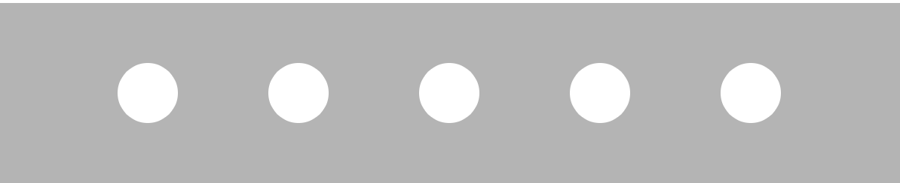
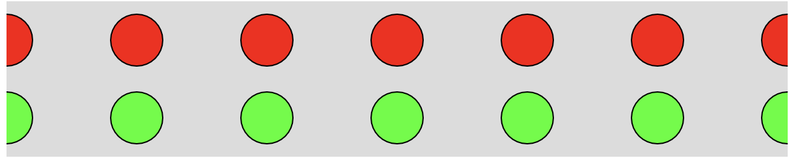
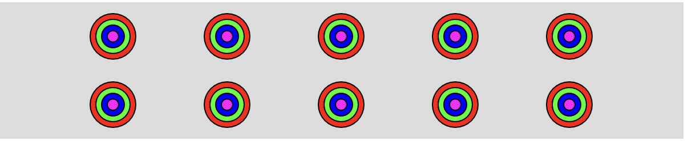
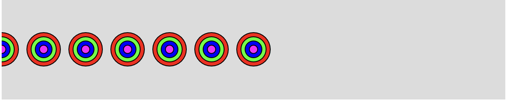
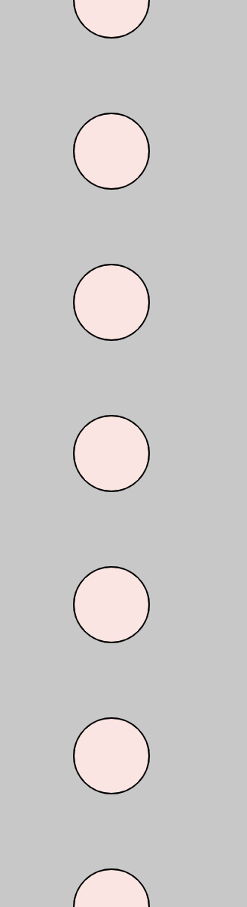

# For Loops

Each for loop has a set structure. Let's look at an example:

```javascript
for(let i = 0; i<5; i++){
  //DO SOMETHING
}
```

Here's a more precise look at exactly how these three statements are implemented. This is generally not helpful for first-time students.

- The first statement is the starting value of the loop - it's run only once, before the loop begins. The loop above begins with the number 0, but could start anywhere.
- The second statement is run before each iteration in the loop. The code block is only executed when this second statement evaluates to `True`.
- The third statement is run after each iteration in the loop. much we want to increment by every time the loops runs. In the above example, i will increase by 1 (`i++` is shorthand for `i = i + 1` or `i += 1`), but you could just as easily skip-count by 3s or any other number with something like `i = i + 3`.

## Task Today

1. Open the `script.js` file and complete questions 1 - 6 found below the `setup` and `draw` functions.

2. Create a for loop that generates the following image across the entire width of the canvas:



3. Create a for loop that generates the following image across the entire width of the canvas:



4. Create a for loop that generates the following image across the entire width of the canvas. **HINT**: Feel free to take code from the while loops lesson!



5. Create a for loop that stops drawining circles in the middle of the page:



6. Create a for loop that draws circles from the **TOP** of the page to the **BOTTOM** of the page.

